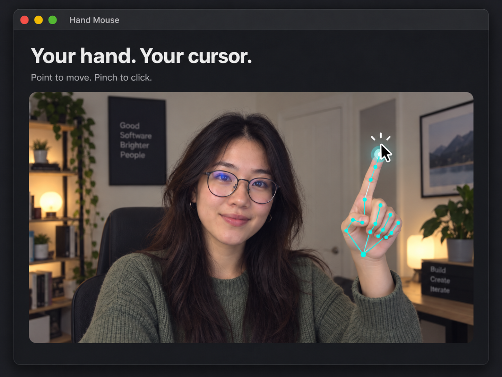

# Hand Mouse

**Control your Mac's mouse with your hand.** Move your **index fingertip** to move the pointer. Clicks stay **off** until you turn them on — then choose **Pinch** or **Dwell**. Runs locally with your camera and Apple's hand tracking — no accounts, cloud, or model downloads.

## First launch (~10 seconds)

The window is grouped: **Camera → Setup → Pointing → Clicking**.

1. **Setup:** **Enable Accessibility** → turn on **Hand Mouse** (add `~/Applications/Hand Mouse.app` with **+** if needed).
2. **Camera:** **Start camera** → allow camera access.
3. **Pointing:** show **one hand**, palm visible; **index fingertip** moves the pointer inside the dashed guide.
4. **Clicking:** leave **Allow clicks** off while you practice. When ready, enable it and pick **Pinch** or **Dwell** (click controls stay dimmed until clicks are allowed).

Keep a trackpad or mouse nearby. **Esc** (or **Pause camera** / menu-bar hand) pauses capture.

## Setup with Codex

You need **macOS 13+**, a camera, and Apple's free **Xcode Command Line Tools**. Apple Silicon and Intel builds are supported; live testing so far is on Apple Silicon.

**Copy this prompt into Codex on your Mac:**

```text
Install Hand Mouse on this Mac from https://github.com/diegocp01/mac-hand-mouse.git.
Check that Apple's Xcode Command Line Tools are installed; if they are missing,
help me install them first. Clone the repository into a suitable local folder,
review its installation script, then run bash "Install Hand Mouse.command"
from the repository to build and install the app in ~/Applications.
If Hand Mouse is already running, help me quit it before installing.
Open the installed app and guide me through enabling Accessibility and
camera access. Show me where to launch it next time.
```

Codex can handle cloning, building, and installing. You may need to finish Apple's tools installer and approve macOS permissions yourself. No ZIP download needed.

## Developer setup

If the Command Line Tools are missing, run `xcode-select --install` in Terminal and finish installation first. Then clone and install:

```sh
git clone https://github.com/diegocp01/mac-hand-mouse.git
cd mac-hand-mouse
bash "Install Hand Mouse.command"
```

The installer builds from source, installs **Hand Mouse** in `~/Applications`, and opens it. For editing, tests, and running a development build, see [development notes](docs/DEVELOPMENT.md).

## Use

| Action | How |
| --- | --- |
| Move the pointer | Move your **index fingertip** inside the dashed box. Soft edges — no hard wall at the crop. |
| Practice without clicking | Leave **Allow clicks** unchecked (default). Aim freely; no mouse click is sent. |
| Practice without moving the system pointer | Uncheck **Control mouse pointer**. |
| Turn on clicks | Check **Allow clicks**. Your choice is saved. |
| Left-click — Pinch | Select **Pinch**. Touch **thumb + index** together briefly, then separate before the next click. |
| Left-click — Dwell | Select **Dwell**. Hold the pointer still ~0.65s. Move to cancel; move again before the next dwell. |
| Easier pinches | Under **Pinch feel**, choose **Easy** (Pinch mode only; saved). |
| Practice a click target | Aim at **Test click** and fire a click; the count rises when the button receives it. |
| Pause | **Esc**, **Pause camera**, or the menu-bar hand icon. |

**Tips:** one hand, palm visible, even lighting. Closing the window pauses capture. For multiple monitors, put the app window on the screen you want before starting.

**Hand colors:** green = tracking · blue = pinch/dwell armed · white flash + **Click!** = a real click was sent · status line says when you're ready again.

## What it does *not* do (yet)

Dragging, scrolling, right-click, double-click, and tap-to-click are **not** included. Keep your physical mouse/trackpad available.

## Troubleshooting

- **Camera blocked:** click **Camera Settings**, enable Hand Mouse, then restart if macOS requests it.
- **Hand detected, but mouse won't move:** enable Accessibility for the installed app.
- **Permission stopped working after an update:** click **Show this app in Finder** to identify the exact running copy, then remove the old permission entry and add that copy again. If toggling still does not work, see the [targeted permission reset](docs/DEVELOPMENT.md#repair-a-stale-local-permission). On macOS 27 the permission pane is called **Device Control and Data Access**.
- **Tracking is intermittent:** improve lighting, keep your palm and fingertips visible, and show only one hand.
- **Escape doesn't pause outside the app:** global Escape needs Accessibility permission; use the window or menu-bar pause button.
- **Unexpected clicks:** turn **Allow clicks** off (default). See [safety notes](docs/SAFETY.md).

## Privacy

Hand Mouse processes camera frames on your Mac. It does not record or upload video, hand landmarks, or keystrokes; it requests no microphone access and includes no telemetry. Camera permission enables tracking. Accessibility permission enables mouse control and the Escape pause key.

## Build, test, and package

```sh
bash scripts/test.sh
bash scripts/build.sh
bash scripts/package.sh
```

Packaging creates a universal Mac ZIP and checksum in `dist/`. These archives are locally signed and **not notarized**; downloaded binaries may be blocked by macOS. The source installer above is the supported setup path. See the [v1.2 audit and fixes](docs/AUDIT.md), [safety notes](docs/SAFETY.md), and [development notes](docs/DEVELOPMENT.md) for tuning, tests, and release details, and [CONTRIBUTING.md](CONTRIBUTING.md) for contributions.

## License

[MIT](LICENSE). See [third-party notices](THIRD_PARTY_NOTICES.md) for Apple system frameworks and build tooling.
