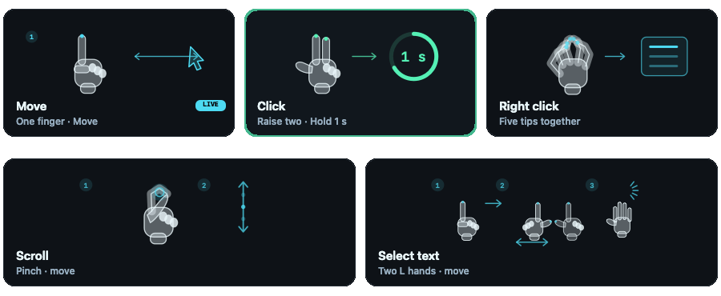

# Point and hold

The active gestures are index-only movement, a one-second two-finger hold for left-clicking, a five-fingertip pinch for right-clicking, thumb/index pinch scrolling, and optional two-hand L dragging. The previous [two-finger tap](TWO_FINGER_TAP.md) detector is retained for regression coverage and is not an active click mode.

This camera-free snapshot illustrates the guide. Its partial ring explains the countdown; live progress comes from observed gesture timing.

## Move and left-click

Acquire one hand with the palm visible and only the index finger extended. Move the index fingertip to aim. Raise the middle finger alongside it to hold the current target and begin the left-click countdown. A ring appears immediately and fills during the one-second hold. The click fires when that countdown completes, not when the fingers are lowered.

Each raise produces at most one click. Lower the middle finger to return to index-only aiming and prepare the next click. Lowering it before the countdown completes or moving the hand too far cancels that click. Tracking loss, pause, permission changes, and competing gestures clear pending intent. Resuming movement reanchors at the held pointer rather than applying hand travel from the hold.

## Right-click

Bring all five fingertips together. Recognition requires confident observations of every fingertip; an unseen finger does not count as pinched. A short confirmation of about 100 milliseconds sends one right-click at the held target. Keeping the pinch closed does not repeat it. Open the hand before another right-click, including after a canceled confirmation.

The five-finger pinch has priority over ordinary thumb/index scrolling so it does not also scroll or left-click. Keep the other fingers distinct from a simple thumb/index pinch when scrolling. Physical recognition of the five-finger gesture needs testing because the fingertips can obscure one another.

## Scroll and select text

Thumb/index pinch scrolling keeps its existing behavior: hold that pinch briefly with a visible palm, then move vertically. Release to stop and resume aiming. It remains separately configurable from clicks. Optional two-hand L dragging still selects text or drags with the original hand; opening either L releases the drag.

## Preferences and practice

Click and Steady aim default to on. A saved manual Click choice wins on relaunch, including an existing Off choice. Practice turns system clicks off for the current session without overwriting that preference. Practice output remains isolated from system pointer, click, scroll, and drag events. The camera starts paused on every launch.

Steady aim makes smaller adjustments during slow hand movements while preserving normal travel for faster movements. It uses hand motion, not button bounds or target recognition. The existing smoothing settles at the fine adjustment without subsequently pulling the pointer toward the full-speed mapped position. Manual Precision mode remains available. Neither setting changes the one-second left-click hold.

## Validation

Synthetic tests can check countdown timing, cancellation, one-click-per-raise behavior, right-click rearming, gesture priority, output isolation, and pointer reanchoring. Static guide snapshots can check layout and gesture labels. Neither verifies physical recognition or improved click accuracy.

With a camera, compare small-target aiming with Steady aim on and off. Confirm that the ring begins when the middle finger rises, fills throughout the one-second hold, and clicks once at completion. Cancel halfway by lowering the middle finger, then repeat after a successful click. Check that small hand movements during a hold do not move the target or cause a jump afterward, and that excessive movement cancels the hold. Test the five-finger pinch from several angles, an obscured fingertip, a held pinch, and reopening after both a successful right-click and a canceled confirmation. Check that thumb/index scrolling remains distinct. Repeat with both hands, different lighting and cameras, and Precision on and off; perform the first attempts in Practice.
