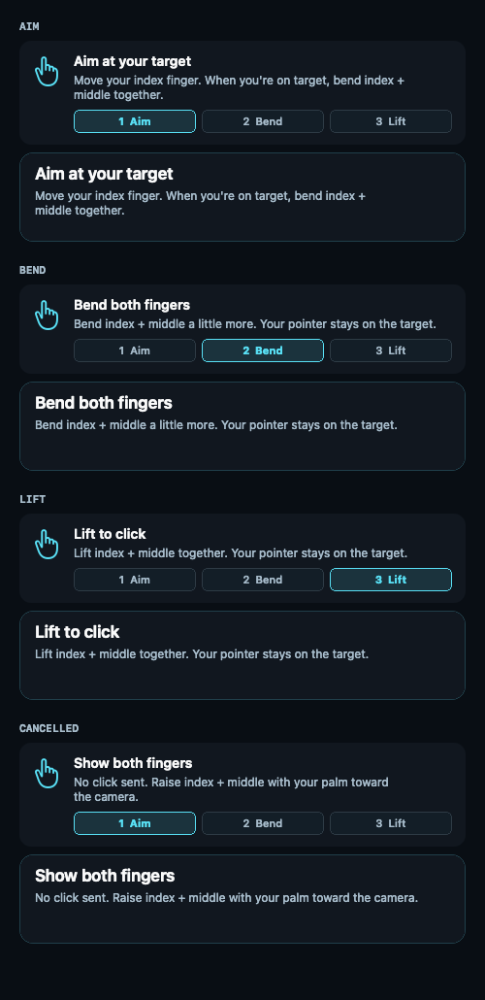

# Two-finger tap

The app now selects two-finger tap on launch, including for existing pinch/forward users. Legacy detectors remain internal for regression coverage; they are not selectable click modes. Allow clicks is preserved. Scrolling uses a distinct thumb + index pinch when Pinch to scroll is enabled. Extended index + middle alone never starts scrolling. One-hand pinch dragging is unavailable; optional two-hand L dragging still interrupts tap intent.

Start with index and middle extended, palm visible. Aim with the index, bend both fingers, then extend them again. The camera classifies each finger using aspect-corrected tip/PIP/MCP geometry with confidence >= 0.6. Both extended is raised; both folded is bent; intermediate visible shapes are transitions. Missing confident joints cancel intent.

Bring index + middle together to stop the pointer immediately before bending. The lock starts on the first confident observation at a fingertip gap of at most 30% of palm width, stays through holds and tap timeouts, and releases at 42% to avoid jitter. Separation reanchors movement at the held cursor so hand travel during the lock cannot cause a jump. Missing proximity measurements retain an existing lock; tracking interruption clears it. This stop gesture requires Allow clicks and does not itself click.

A raise must last 0.15 seconds before arming. The pointer freezes from the first transition, with up to 0.8 seconds to reach the first bent observation. That observation starts a separate 0.65-second window to lift; later bent/transition observations never extend it. A tap still needs at least two bent observations and at least 0.05 seconds since the initial transition (or direct bend). This allows a gradual start without requiring a longer hold. It clicks on the return to raised, never while held bent. Release/cancel reanchors the pointer to avoid a fingertip jump. Another sustained raise is required before the next tap. Tracking interruption, permissions, pause, destination/settings changes and two-hand dragging clear tap state.

The persistent guide highlights **Aim → Bend → Lift**. Practice and system control use the same next-action model: `Bend both fingers` during an incomplete bend, `Lift to click` only when the detector can accept release, and a specific retry hint after a timeout, incomplete bend, or missing finger landmarks. A canceled tap never retains the lift cue, even if the separate-fingers pointer lock remains engaged. Practice keeps Gesture settings collapsed and shows target-hit feedback before the idle lock hint. There are no new gesture modes or tuning controls.

Native guide and feedback snapshots below use simulated detector frames, with no camera or system input. Both 644- and 460-point layouts were checked for clipping and ambiguous layout on macOS 27, Apple Silicon.

Validation: detector and production-engine regression tests cover normal cycles, stationary hands, single-finger transitions, long holds, missing observations, stale frames, disabled clicks, practice isolation, cursor anchoring and scrolling arbitration. These tests are synthetic, not proof of physical recognition accuracy. Before calling the gesture reliable, test left/right hands, lighting, slow aiming, curled fingers, occlusions and target accuracy with the camera. Bend enough for the camera to see both fingertips fold toward their knuckles; a small downward translation of a straight hand is not a tap.

## Steady aim, scrolling and precision

Steady aim is enabled by default and can be turned off in Gesture settings. It reduces pointer travel during slow, careful hand movement while keeping normal travel for faster movements. It responds to hand movement, not button bounds or target recognition. The existing smoothing briefly settles at the fine adjustment; holding still does not then pull the pointer back toward the full-speed mapped position.

The filter applies speed-dependent gain to each mapped movement, with an offset limited to 48 display points per axis. The limit narrows smoothly near screen edges, preserving corner reach. This is a local fine adjustment: longer travel can exhaust the offset and return to normal gain. Gain changes never reposition a stationary hand's target. Reanchoring clears the offset on acquisition, after a click lock, or when switching to full-speed dragging.

Steady aim preserves the existing finger-separation lock and release-to-click behavior. Bring index + middle together to hold the target, then bend and lift to click as usual. Manual Precision mode remains available for further reducing pointer travel.

A confident thumb/index pinch plus a visible palm enters scroll confirmation immediately and cancels tap intent. Hold the palm steady for 0.25 seconds (at least four observations), then move it vertically while pinched. The existing bounded scroll detector emits no inertia. Release or missing pinch/palm measurements stops scroll output and reanchors the index at the held cursor. Two-hand L dragging retains priority. Practice output stays isolated from system events; scrolling can be enabled separately from clicks.

Precision mode reduces mapped hand displacement to 35% around the current hand anchor. Changing the setting resets acquisition at the current cursor. It is intended for nearby small targets; lower and raise the hand to reposition. Target freeze and scroll speed remain unchanged.

The cursor caption shows `Bend to click` while a ready finger-separation lock holds outside an active tap, scroll, or drag; the status panel explains that the pointer is locked and separating the fingers resumes movement. During a tap, both practice and system control show the next action from the detector. Physical recognition and comfort still need camera testing.

For manual Steady aim validation, compare it on and off while approaching small targets from several directions, making fine corrections, and then holding still. Check for overshoot, drift after stopping, and jumps when separating locked fingers or resuming after a tap or scroll. Repeat with Precision mode on and off, both hands, and different lighting and cameras. Synthetic tests can check motion behavior and gesture interactions; they do not verify physical tuning or improved click accuracy.
